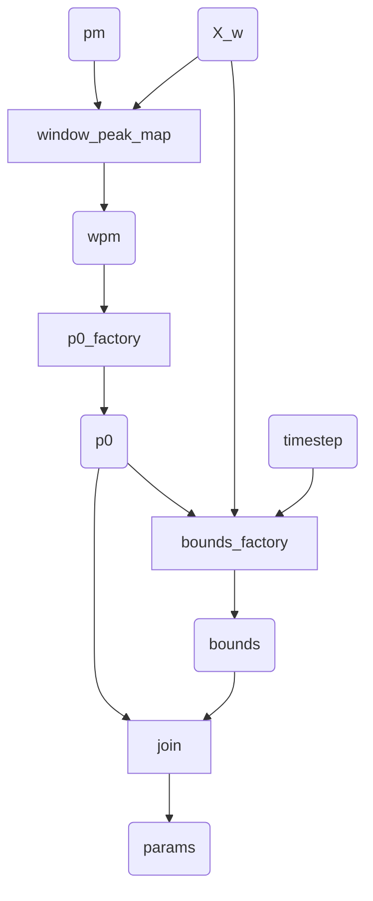

# prepare_popt_input.params_factory

A diagram depicting the runtime flow within `params_factory` taking the peak map and windowed X and producing a table containing the lower and upper bounds and initial guess of the parameter values to fit the skewnorm distribution to X.

## help

[guide to symbols](https://www.researchgate.net/figure/Standard-Flowchart-Symbols_fig1_338671462)

[mermaidjs cheatsheet](https://jojozhuang.github.io/tutorial/mermaid-cheat-sheet/)

io node: `A[/Christmas/]`