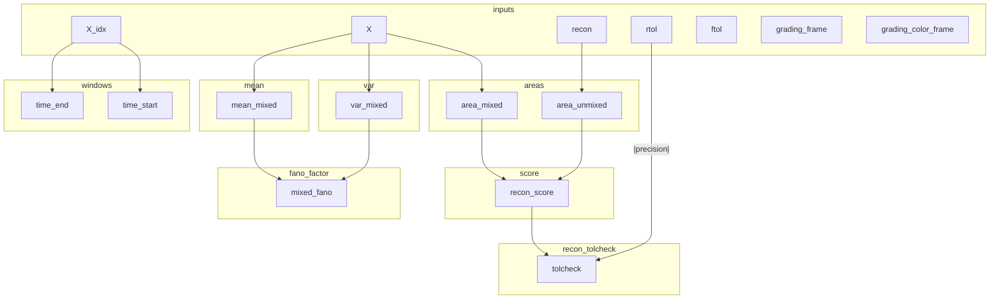

subgraph INPUT

```mermaid
flowchart TD

subgraph inputs
  X_idx
  X
  recon
  rtol
  ftol
  grading_frame
  grading_color_frame
end

subgraph windows
  X_idx-->time_start
  X_idx-->time_end
end

subgraph areas
X-->area_mixed
recon-->area_unmixed
end

subgraph var
X-->var_mixed
end

subgraph mean
X-->mean_mixed
end

subgraph fano_factor
var_mixed-->mixed_fano
mean_mixed-->mixed_fano
end

subgraph score
area_unmixed-->recon_score
area_mixed-->recon_score
end

subgraph recon_tolcheck
recon_score-->tolcheck
rtol--|precision|-->tolcheck
end


```