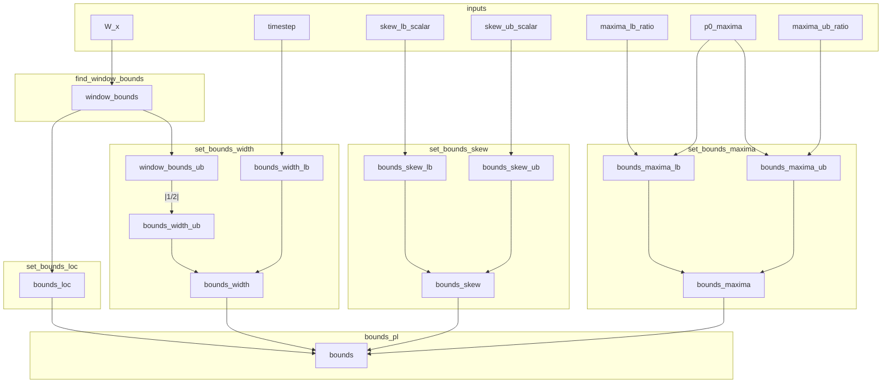

# Bounds Factory

The bounds factory takes the windowed time: W_t and initial guesses: p0, and produces upper and lower bound values. Calculated as follows:

 | parameter | bound | definition                          |
|-----------|-------|----------------------------------|
| amplitude |   lb  | 10% peak maxima                  |
| amplitude |   ub  | 1000% peak maxima                |
| location  |   lb  | minimum time index of the window |
| location  |   ub  | maximum time index of the window |
| width     |   lb  | magnitude of the timestep        |
| width     |   ub  | half the width of the window     |
| skew      |   lb  | -inf                             |
| skew      |   ub  | +inf                             |

