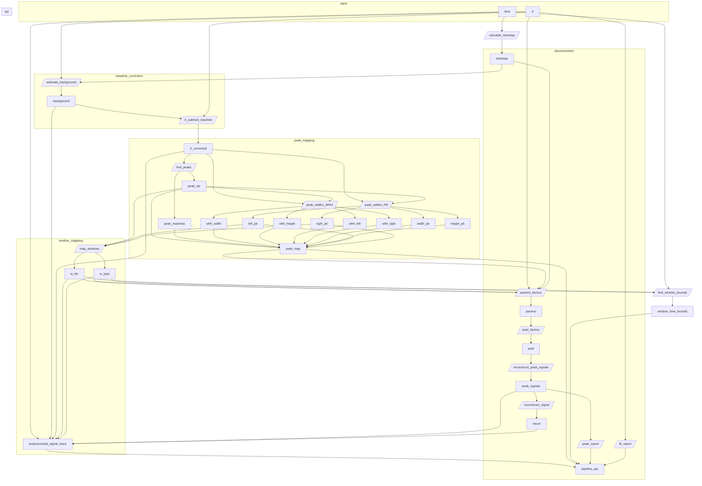

# Pipeline Flow Chart

A flow chart representing the pipeline process

```mermaid
flowchart TD

pipeline_api
preprocessed_signal_store

subgraph input
  time
  X
end

time-->calculate_timestep[/calculate_timestep/]-->timestep
timestep-->estimate_background[/estimate_background/]
X-->estimate_background

subgraph baseline_correction
estimate_background
background-->X_subtract_baseline[/X_subtract_baseline/]
X-->X_subtract_baseline
estimate_background-->background
end

X_subtract_baseline-->X_corrected
X_corrected-->find_peaks

time-->preprocessed_signal_store
background-->preprocessed_signal_store
X_corrected-->preprocessed_signal_store
preprocessed_signal_store-->pipeline_api

find_peaks[/find_peaks/]
peak_widths_WHH[/peak_widths_WHH/]
peak_widths_PB[/peak_widths_PB/]
peak_map
subgraph peak_mapping

find_peaks-->peak_idx
find_peaks-->peak_maximas

peak_idx-->peak_map
peak_maximas-->peak_map

X_corrected-->peak_widths_WHH
peak_idx-->peak_widths_WHH

peak_widths_WHH-->whh_width-->peak_map
peak_widths_WHH-->whh_height-->peak_map
peak_widths_WHH-->whh_left-->peak_map
peak_widths_WHH-->whh_right--> peak_map

X_corrected-->peak_widths_PB
peak_idx-->peak_widths_PB
peak_widths_PB-->width_pb-->peak_map
peak_widths_PB-->height_pb-->peak_map
peak_widths_PB-->left_pb-->peak_map
peak_widths_PB-->right_pb--> peak_map
end 

peak_map --> pipeline_api

map_windows[/map_windows/]
window_time_pivot[/find_window_bounds/]

subgraph window_mapping

peak_idx-->map_windows
left_pb-->map_windows
right_pb-->map_windows

map_windows-->w_idx-->preprocessed_signal_store
map_windows-->w_type-->preprocessed_signal_store
end

time-->window_time_pivot
w_idx-->window_time_pivot
w_type-->window_time_pivot
window_time_pivot-->window_time_bounds-->pipeline_api

params_factory[/params_factory/]
popt_factory[/popt_factory/]
construct_peak_signals[/reconstruct_peak_signals/]
reconstruct_signal[/reconstruct_signal/]
peak_report[/peak_report/]
fit_report[/fit_report/]

subgraph deconvolution
  X-->params_factory
  w_type-->params_factory
  w_idx-->params_factory
  peak_map-->params_factory
  timestep-->params_factory
  params_factory-->params

  params-->popt_factory-->popt

  popt-->construct_peak_signals-->peak_signals-->preprocessed_signal_store
  peak_signals-->reconstruct_signal-->recon
  recon-->preprocessed_signal_store
  peak_signals-->peak_report-->pipeline_api
  X-->fit_report-->pipeline_api
end
subgraph api
  pipeline_api
end
```